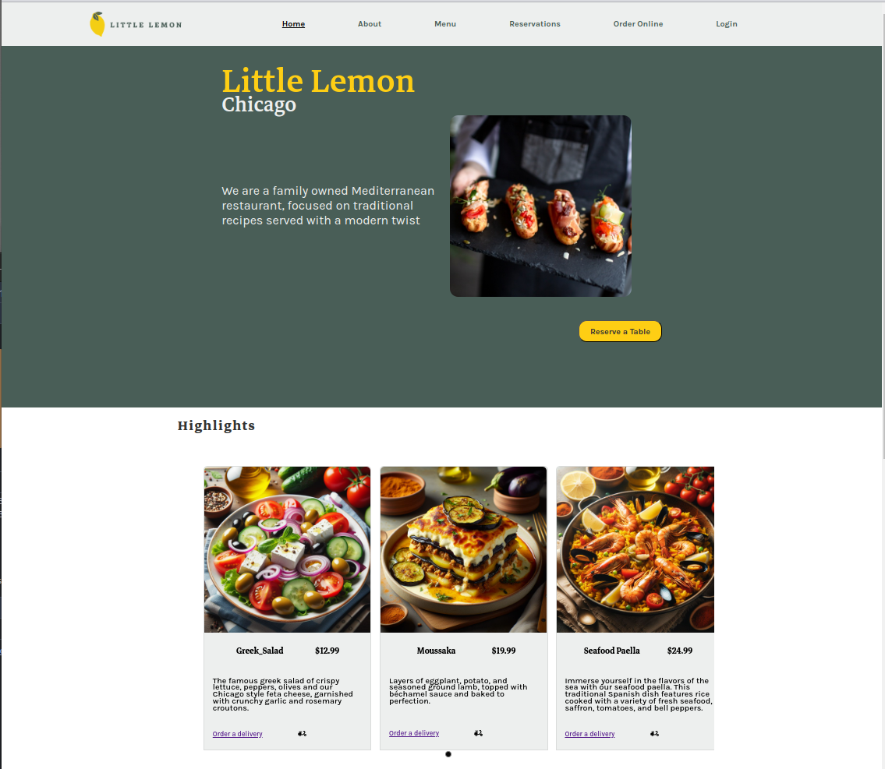

# Little Lemon Front-End Capstone

Welcome to the Little Lemon Front-End Capstone project! This project showcases a modern, responsive front-end application for a fictional restaurant, Little Lemon.

## Project Overview

Little Lemon's front-end capstone project is built using React, harnessing cutting-edge web technologies to deliver seamless compatibility across all devices. Our primary aim is to create an intuitive user experience where visitors can effortlessly browse our product offerings and delve into our narrative.


## Technologies Used
- React.js
- HTML5
- CSS3 (with Flexbox and Grid)
- JavaScript (ES6+)

## Installation

To get a local copy up and running, follow these simple steps:

1. Clone the repository to your local machine:
```bash
    git clone https://github.com/Ricardo-Suarez-Chacon/little-lemon.git
```
2. Navigate to the project directory:
```bash
    cd little-lemon
```
3. Install the necessary packages:
```bash
    npm install
```
4. Start the development server:
```bash
    npm start
```
The application should now be running on http://localhost:3000.

## Image Attribution
Images used in this project have been generated using artificial intelligence (AI) tools, specifically Microsoft Copilot. While these images are generated and typically intended for unrestricted use, it is advisable to review and comply with any applicable licenses or usage rights associated with the original content or source materials used by the AI model. Please note that these images are used exclusively for academic purposes within this project.